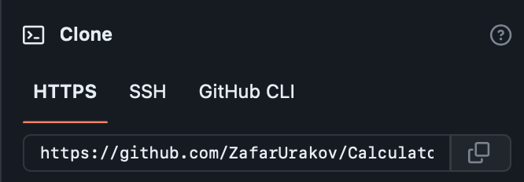

# DrawnFigurines
#### in this project you can see an example of the class , method , loop operations and so on.
#### Types
```C#
int & double & string & char
```
#### Functions:
```C#
Output to console: Console.WriteLine();
Intput from console: Console.ReadLine();
Converts: Convert.ToDouble();
```
#### Operators:
```C#
for(){...}
```
Loops can execute a block of code as long as a specified condition is reached.

Loops are handy because they save time, reduce errors, and they make code more readable.
```C#
for (statement 1; statement 2; statement 3) 
{
  // code block to be executed
}
```


**Statement 1** is executed (one time) before the execution of the code block.

**Statement 2** defines the condition for executing the code block.

**Statement 3** is executed (every time) after the code block has been executed.


```C#
Classes
public class Messages{...}

Methods
static void Name(){...}
```


Also in the code i used ***Escape Characters*** - replacement of control characters in the text with corresponding text substitutions.
Read more, [link](https://codebuns.com/csharp-basics/escape-sequences/).

#### Demo


## Release Notes
As for this version , you may notice changes in the code like:

- Added Classes:
- Added Methods
- Simplified the code.
- Fixed the errors.

Quickly go and try to use.

You can take my code and try it yourself 👇🏻

1.About the list of files,click <> Code.


2.Copy the URL(HTTPS) of the repository.




3.Open terminal.

4.Change the current working catalogue ti the location where the cloned catalogur should be located.

5.Type "***git clone***" and paste the URL copied earlier.


6.Press enter to create a local clone.


To see other projects click [HERE](https://github.com/ZafarUrakov).